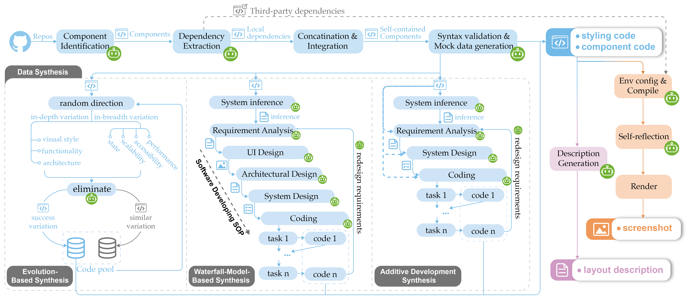

<h1 align="center">Flame: 用于前端代码生成的大型视觉语言模型</h1>

<p align="center">
  <a href="README.md">English</a> | <a href="README_zh.md">中文</a>
</p>

- [介绍](#介绍)
- [特性](#特性)
- [安装](#安装)
- [使用](#使用)
- [数据集](#数据集)
- [贡献](#贡献)
- [许可证](#许可证)
- [致谢](#致谢)

## 介绍
Flame 是一个开源的大型视觉语言模型（VLM），专为前端代码生成而设计。它旨在通过利用多模态学习技术，弥合 UI 设计稿与可执行前端代码之间的差距。本仓库包含了 Flame 的数据准备管道、训练过程和评估管道的完整实现。通过结合自动化数据合成、训练和基准测试，Flame 在视觉到代码的任务中实现了最先进的性能，特别是在基于 React 的开发中。

## 特性



- 全面的数据准备管道：仓库包含使用三种不同数据合成方法提取、合成和结构化多模态数据集的脚本和工具：
    - 基于进化的合成
    - 基于瀑布模型的合成
    - 增量开发合成
- 端到端训练管道：实现了 Flame 的三阶段训练策略，包括：
    - 使用公共数据集进行视觉编码器预训练
    - 使用合成数据集进行图像布局解释训练
    - 完整的指令调优，用于图像到代码生成
- React 代码生成的评估管道：仓库提供了：
    - Flame-React-Eval 基准测试数据集
    - 用于功能正确性和视觉保真度评估的自动化测试脚本
    - 使用渲染输出的余弦相似度实现 pass@k 评估指标
- 支持多图像输入：模型和管道通过处理多个版本的设计稿并相应地更新生成的代码，实现迭代式 UI 优化。

本仓库提供了所有必要的脚本、模型和评估工具，以重现我们的实验并扩展 Flame 以进行多模态前端代码生成的进一步研究。

## 安装
按照以下步骤进行安装：

1. 克隆仓库：
    ```sh
    git clone 
    ```
2. 进入项目目录：
    ```sh
    cd Flame
    ```
3. 创建 conda 环境：
    ```sh
    conda env create -f environment.yml
    conda activate flame
    ```
4. 安装 node 依赖：
    ```sh
    npm install
    ```

## 使用

### 数据准备
数据准备管道包含 3 个主要步骤：

#### 1. 生成自包含的组件代码片段

要从 GitHub 上的仓库生成自包含的组件代码片段，可以运行以下命令：

```sh
bash scripts/collect_gh_code_run.sh
```
在 collect_gh_code.sh 脚本中，有三个步骤分别用于收集仓库、提取组件和提取代码中使用的图像。您可以根据需要在脚本中指定参数：
```sh
echo "步骤 1: 收集仓库..."
python3 -B data_collect/repo_collector/collect_info.py \
  --language '目标语言' \
  --start_date '目标开始日期，格式为 "YYYY-MM-DD"' \
  --end_date '目标结束日期，格式为 "YYYY-MM-DD"' \
  --per_page 'GitHub API 每页克隆的仓库数量' \
  --sleep_time '每次请求 GitHub API 之间的休眠时间' \
  --star '目标仓库的最小 star 数' \
  --time_range '时间范围' \
  --kw '关键词' \
  --output_repo_path '存储仓库的输出目录' &

echo "步骤 2: 收集组件..."
python3 -B data_collect/component_collector/distiller/distiller_cls.py \
  --threads '线程数' \
  --repo_path '下载的仓库目录' \
  --output_path '存储生成的自包含组件代码片段的输出目录' &

echo "步骤 3: 提取代码中使用的图像..."
node data_collect/component_collector/distiller/img_distiller.js \
  '下载的仓库目录' \
  '下载的仓库的组件代码片段目录' &
```
#### 2. 将代码片段渲染为图像
要将代码片段渲染为图像，首先指定参数：
```sh
CODE_DIR='下载的仓库的组件代码片段目录'
SCREENSHOT_DIR="存储渲染图像的输出目录"
```
然后运行以下命令：
```sh
bash scripts/renderer_run.sh
```

#### 3. 为代码片段生成指令
要为代码片段生成指令，首先指定参数：
```sh 
INST_PATH="存储最终多模态数据的输出目录"
nohup python -B -u data_collect/component_collector/describer/gen_inst.py \
  --screenshot_path '渲染图像的目录' \
  --code_path '下载的仓库的组件代码片段目录' \
  --inst_path $INST_PATH \
  --ori_img_path $INST_PATH/ori_images \
  --cropped_img_path $INST_PATH/cropped_images >log/batch_inst.log 2>&1 &
```
然后运行以下命令：
```sh
bash scripts/gen_inst.sh
```

### 数据合成
要使用基于瀑布模型的方法合成数据，首先在 run_batch_variation_no_code.sh 脚本中指定参数：
```sh
nohup python3 -B -u data_collect/component_collector/variater/variation_waterfall_no_code.py \
    --iter_num='整个工程过程的迭代次数' \
    --max_system_infer='开始时推断的系统数量' \
    --screenshot_path='收集的组件代码片段的截图目录' \
    --repo_path='收集的仓库目录' \
    --variation_path='保存合成代码片段的输出目录'>log/comp_variation_waterfall.log 2>&1 &
```
然后运行以下命令：
```sh
bash scripts/run_batch_variation_no_code.sh
```
要使用增量开发方法合成数据，首先在 run_batch_variation_with_code.sh 脚本中指定参数：
```sh
nohup python3 -B -u data_collect/component_collector/variater/variation_waterfall_with_init_code.py \
    --iter_num='整个工程过程的迭代次数' \
    --screenshot_path='收集的组件代码片段的截图目录' \
    --repo_path='收集的仓库目录' \
    --variation_path='保存合成代码片段的输出目录'>log/comp_variation_waterfall_with_init_code.log 2>&1 &
```
然后运行以下命令：
```sh
bash scripts/run_batch_variation_with_code.sh
```

## 训练

## 评估

要评估模型，首先使用以下命令生成代码：

生成代码后，可以通过首先在 batch_eval_renderer.sh 脚本中指定参数来渲染这些代码并获取截图：
```sh
GEN_CODE_DIR="<生成的代码目录>"
SCREENSHOT_DIR="<保存截图的目录>"
```
然后运行以下命令：
```sh
bash scripts/batch_eval_renderer_run.sh
```
最后，通过在 eval_score.sh 中添加模型名称来获取 pass@k 分数：
```sh
MODEL_NAMES=("要评估的模型名称")
```
然后运行：
```sh
bash scripts/eval_score_run.sh
```

## 数据集
我们已经开源了使用我们的数据收集和合成方法构建的数据集，以及用于评估的测试数据集：
- Flame-Waterfall-React: <https://huggingface.co/datasets/Flame-Code-VLM/Flame-Waterfall-React>
- Flame-Additive-React: <https://huggingface.co/datasets/Flame-Code-VLM/Flame-Additive-React>
- Flame-Evo-React: <https://huggingface.co/datasets/Flame-Code-VLM/Flame-Evo-React>
- Flame-Eval-React: <https://huggingface.co/datasets/Flame-Code-VLM/Flame-Eval-React>

## 贡献
我们欢迎开源社区贡献以改进 Flame 的数据集、模型和评估管道。如果您有兴趣贡献，请按照以下步骤操作：
1. Fork 本仓库
2. 为您的更改创建一个新分支。
3. 提交一个包含修改清晰描述的 pull request。

## 许可证
Flame 采用 Apache 2.0 许可证发布。有关更多详细信息，请参阅 [LICENSE](LICENSE) 文件。

## 致谢
本项目受到大型视觉语言模型和自动化前端开发最新进展的启发。我们感谢开源社区以及视觉语言建模和自动化代码生成领域的先前研究的贡献。